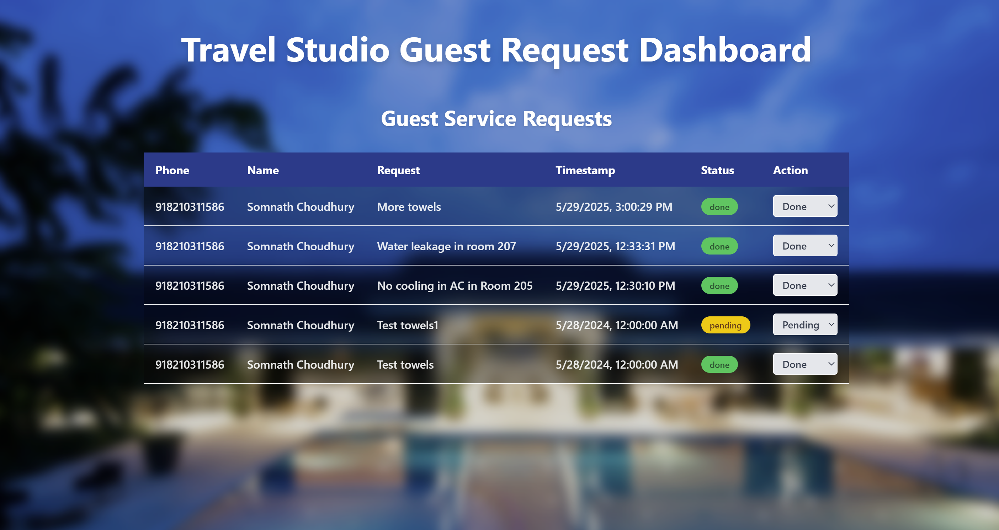

# 🏨 Travel Studio Guest Request Dashboard

This is a full-stack web application designed to help hotel staff manage guest service requests received via WhatsApp. It features a real-time dashboard with status tracking, built using modern web technologies.




---

## Tech Stack

### Frontend
- **Next.js 14** (App Router)
- **TypeScript**
- **Tailwind CSS**
- **Zustand** (for global state)
- **TanStack Query (React Query)** (for data fetching & caching)

### Backend
- **NestJS**
- **Supabase** (as the PostgreSQL database & API layer)

### Automation: 
- **WhatsApp Business API**
- **n8n** (automation platform for handling WhatsApp triggers)

---

## ✨ Features

- ✅ View live guest service requests received over WhatsApp
- 🔄 Mark requests as `done` or `pending` from a dropdown
- ⏱️ Requests include timestamps, phone numbers, and message text
- 💬 Integrated with WhatsApp Business via n8n
- 🧊 Frosted glass UI with hotel-themed background

---

## 🚀 Getting Started

### 1. Clone the repository

```bash
git clone https://github.com/somnath-choudhury/travel-studio-intern-assignment.git
cd travel-studio-intern-assignment
```

### 2. Setup Backend
```bash
cd assignment-backend
npm install
```
#### 2.1. Setup the supabase authentication credentials:
Inside src/supabase/supabase.client.ts 
set the supabaseUrl and supabseKey according to the supabase account which you have created.
Or you may create a .env and store it there for more safety.

```bash
SUPABASE_URL=your-supabase-url
SUPABASE_KEY=your-service-role-key
```
#### 2.2. Run the backend
```bash
npm run start
```

### 3. Setup Frontend:
```bash
cd assignment-frontend
npm install
```

#### 3.1 Change the BACKEND_URL
Inside src/lib/api.ts change the backend URL as the URL you might have got when you deployed the backend on Render.
```base
const BASE_URL = "http://localhost:3001"; // or your Render.com URL
```

#### 3.2 Update the NEXT_PUBLIC_API_URL
Create a .env.local and paste the public URL you have got from Render by going into the API section.
```base
NEXT_PUBLIC_API_URL= //your url
```
#### 3.3 Run frontend:
```bash
npm run dev
```

### 4. WhatsApp API Cloud
Create an app on the Meta Developer Dashboard. Add WhatsApp Business into the app. Get the API keys, access tokens as required. Don't forget to give all necessary permissions as required.


### 5. n8n Workflow
Create a new project under n8n.io . Import the json workflow file as given under
root/workflow/request-workflow

#### 5.1 Update the credentials
Update all the credentials according to your app and developer settings. Also update the Postgres credentials after getting it from Supabase. 

### Testing the web app
After starting the frontend and backend both together (keep note of ports please)
Start the n8n workflow and send a message on WhatsApp. The number to be sent can be found under the App Dashboard inside Meta Developer Dashboard.

## Web App deployed on
https://somnath-choudhury-gydexp-intern-assignment.vercel.app/

## Contribution:
Feel free to fork this project and submit pull requests to improve functionality or add new features!

### Developer Info:
Name: Somnath Choudhury  
Email: choudhurysomnath2000@gmail.com  
Mobile: 8210311586
